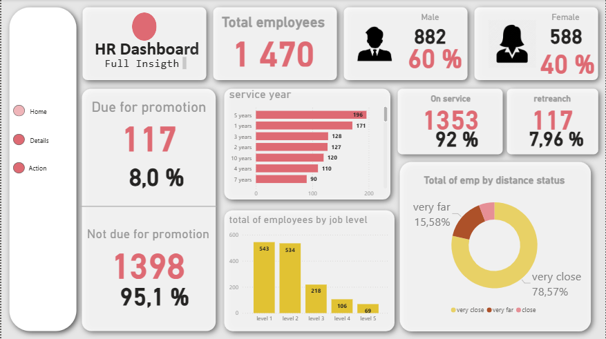
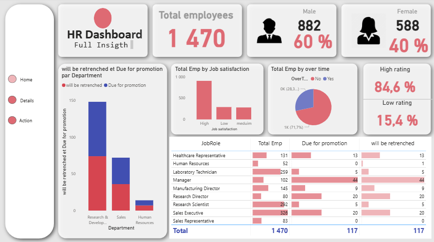
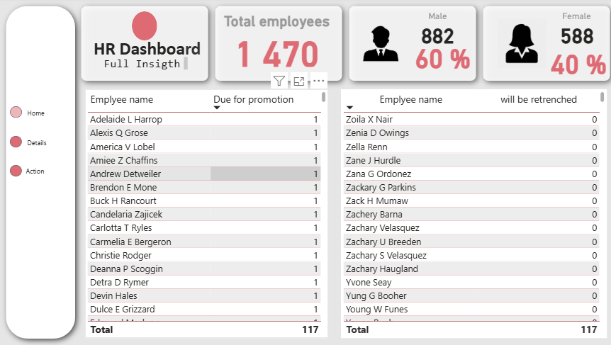

<h1 align="center">📊 HR Dashboard – Power BI Portfolio</h1>

  
  
  
  

  Interactive HR Dashboard developed with Power BI.  
  Analyze employee count, promotions, layoffs, performance evaluations, and more.

---

> All screenshots are stored in the `captures/` folder and displayed below for easy preview.

---

#  Dashboard Pages with Screenshots

## Home Page
- Overview of the company  
- Total number of employees  
- Male/Female percentage  
- Key indicators: headcount, turnover, promotions, layoffs  

  

---

## Details Page
- Employee levels: Level 1 → Level 5  
- Employee performance evaluation and working conditions  
- Ratings by criteria    
- Decisions: promotion, lay-off, retrenchment  

  

---

## Action Page
- Detailed employee list   

  

---

# 🛠️ Tools Used

| Tool | Purpose |
|------|--------|
| **Power BI Desktop** | Build interactive dashboard |
| **Excel / CSV** | Source HR data |
| **Power Query** | Data cleaning & transformation |
| **DAX** | Calculated measures and KPIs |

---

#  Key Features

- Complete HR Dashboard  
- Interactive visualizations for all pages (Home, Details, Action)  
- Track employee count and gender distribution  
- Monitor promotions, layoffs, and retrenchments  
- Evaluate employees with scores/ratings  
- Analyze working conditions and HR benefits  

---

# Attached Data

The project includes **two CSV datasets** used in the dashboard:  

1. `HR Analytics Data.csv` 
2. `HR employee data.csv`  

> Place these CSV files in the same folder as `dashboard.pbix` to ensure the dashboard works correctly.

---

#  How to Use

1. Download `dashboard.pbix`, `HR Analytics Data.csv`, and `HR employee data.csv`  
2. Place all files in the same folder  
3. Open Power BI Desktop  
4. Refresh data to view all metrics and visualizations  

---

